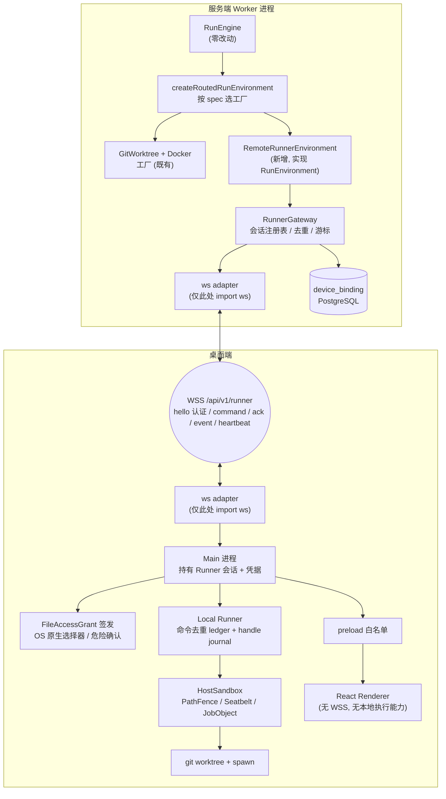

## 产品概述

M2 对应 `docs/latest-development-plan.md` §7「完成 Phase 4B Local Runner」。当前项目已完成 M0（质量门禁）与 M1 代码链路（Phase 4A Connected Desktop），但 Phase 4B 在代码层面基本是空白：`local-runner` 只有一个 `RunEnvironment` 实现（git worktree + `child_process`），没有传输层；`desktop-runner` 是孤儿包；全仓库无 WebSocket。

M2 的目标是让桌面客户端能在用户本机安全执行 Run，同时**服务器端 RunEngine、审批、事件和验证契约不分叉**。

## 核心功能

**M2.1 Runner WSS 协议**

- 定义版本化 WSS envelope、命令 ID、事件游标和错误码；协议核心零依赖，可被确定性测试
- 用设备凭据认证 Runner，绑定 user / project / device；握手不携带凭据，凭据只在首个 `hello` 帧出现
- 断线重连、指数退避、心跳、会话恢复
- 服务端与 Runner 双向幂等去重：重复命令不重复执行副作用
- 从最后确认游标续传事件，禁止丢失
- 设备撤销后立即终止现有 WSS 会话

**M2.2 三档文件访问权限**

- `workspace_only` / `selected_directories` / `host_full` 三档由 **Local Runner 的 OS Sandbox Adapter 在进程创建时强制执行**
- Desktop Main 只经原生交互签发 **Run 级 `FileAccessGrant`**：`selected_directories` 走 OS 原生目录选择器并持久化为最小必要范围；`host_full` 需 OS 原生二次确认、醒目持续状态与一键降权/中止
- 所有路径 canonicalize 后判定，覆盖符号链接、大小写、Windows junction 与路径穿越
- 每次工作区外访问写入不可变审计记录

**M2.3 本地执行恢复与结果处置**

- Local Runner 重启后恢复 worktree 与 Run handle
- 断线时不重复执行正在进行或结果未知的工具调用
- keep/discard 幂等且不污染源仓库
- 取消覆盖准备、命令执行、验证、等待审批四态
- 清理失败留下可观测的残留路径与人工恢复说明

**M2.4 本地验证和安全基线**

- `DesktopLocalEnvironment` 与 `ServerDockerEnvironment` 跑同一套 `RunEnvironment` 接口契约测试
- 校验项目声明的 test/typecheck/lint/build 最低集合
- 在 UI 中展示本地环境与 Docker 的隔离能力差异（无 Docker 级 CPU/memory/PID 隔离）
- 固定 deny、protectedPaths、network.askDomains 在本地环境仍然生效
- Renderer 不直接获得本机执行、文件或凭据能力

## 明确排除（本轮已确认的边界）

- **不手写 RFC 6455 framing**：使用 `ws` 作为 Worker 与 Desktop Main 的 WebSocket Adapter，协议核心保持零依赖
- **不在 Renderer 建立 WSS**：Runner 会话由 Desktop Main 持有，与 `stream-broker.ts` 持有 SSE 的模式一致
- **现有 `ApprovalGate` 与 `HostAccessLog` 不视为权限强制证据**：保留为 UX 与审计辅助，M2.2 的强制证据必须来自新的 OS Sandbox Adapter
- **PolicyEngine 只负责固定 deny 与权限升级审批**，不承担文件系统隔离

## 技术栈选型

沿用仓库现有技术栈，仅新增一处运行时依赖（用户已批准）：

| 项 | 选择 | 说明 |
| --- | --- | --- |
| 语言 / 类型 | TypeScript 5.8，`turbo run typecheck` | 与仓库一致 |
| 测试 | Vitest 3.2，`pnpm test` | 与仓库一致 |
| WebSocket | **`ws`**（新增，仅出现在两处边缘 adapter） | 用户已批准引入；协议核心不 import `ws` |
| 包管理 | pnpm 10 workspace，`workspace:*` | 与仓库一致 |
| 沙箱 | darwin Seatbelt（SBPL，经 `sandbox-exec`）/ win32 Job Object / 跨平台 `PathFence`（`fs.realpath`） | 无原生 addon |


**依赖引入范围**：`ws` 只加入 `apps/worker` 与 `apps/desktop` 两个 app 的 `dependencies`，以及 `@types/ws` 到对应 devDependencies。`packages/runner-protocol` 保持零运行时依赖。

## 实现方案

### 核心策略：RunEngine 零改动的「远端桌面环境」适配器

这是本计划最关键的技术决策。

`packages/run-environment/src/run-environment-factory.ts` 已经提供了完美的 seam：

```ts
export interface RunEnvironmentFactory {
  create(spec: EnvironmentSpec): RunEnvironment | Promise<RunEnvironment>;
}
export function createRoutedRunEnvironment(factory: RunEnvironmentFactory): RunEnvironment;
```

新增一个实现 `RunEnvironment` 的 **`RemoteRunnerEnvironment`**——它内部把 `prepare/perform/inspect/dispose` 经 WSS 转发到桌面的 Local Runner。服务端 `apps/worker/src/index.ts:818-826` 的工厂按 spec 选择 Docker 工厂或 Runner 工厂即可，**RunEngine、审批、事件游标、验证器全部零改动**，天然满足「契约不分叉」。

`RunStatus` 已包含 `environment_offline`（`contracts/src/index.ts:19`），WSS 断线超过恢复窗口后抛出错误，RunEngine 会走既有离线语义，不需要新增状态。

### 六个关键技术决策

**决策 1：执行位置的契约扩展（最小向后兼容）**

当前 `StartRun` 没有「在哪执行」字段。扩展 `packages/contracts`：

- `StartRun` 增加可选 `executionTarget?: "server" | "local"`（默认 `"server"`）
- 增加可选 `deviceId?: string`（`executionTarget === "local"` 时必填）

API 层校验：local 执行必须携带 `deviceId`，且该 device 必须属于当前 principal（经 `deviceService.authenticate()` 或 `listDevicesForUser()` 验证）。默认 `"server"` 保证所有既有调用与测试不变。

**决策 2：认证时序——凭据不进 URL**

WebSocket 握手阶段无法复用 `http-server.ts` 的 `isApiAuthorized`（它读 `incoming.headers.authorization`）。设计：

1. 握手**不携带**凭据（避免 accessToken 出现在 URL query，进而进入 nginx/代理/服务端访问日志）
2. 握手成功后，Runner 必须在 **第一个帧** 发送 `hello { v, deviceAccessToken, capabilities }`
3. 服务端用既有 `deviceService.authenticate({ accessToken })` 绑定 `{deviceId, userId, email, projectId, projectName}`
4. `hello` 成功前收到任何其他帧 → 回 `nack{code:"auth_required"}` 并关闭连接
5. `HELLO_TIMEOUT_MS`（如 5s）内未收到 hello → 关闭连接

**决策 3：命令去重 vs 事件续传——两条独立机制**

二者方向相反，必须分开设计，否则会互相污染：

- **命令方向 = 服务端 → 桌面**。`commandId` 由**服务端**在会话内单调递增分配。桌面侧维护 `Map<commandId, {status, result}>` 并落盘到 commands journal：
- `succeeded` / `failed` → 直接回缓存的 ack，**不重复执行副作用**
- `running` → 回 `nack{code:"command_in_flight"}`，服务端等待而非重发
- 未记录 → 才真正执行
- **事件方向 = 桌面 → 服务端**（进度、输出分片、审计行）。`cursor` 由**桌面**单调递增分配。服务端记录 `lastAckedCursor`；重连时客户端发 `resume{lastAckedCursor, lastReceivedCommandId}`，服务端从 `lastAckedCursor + 1` 重放窗口内事件。

重连时**命令由服务端按 `lastReceivedCommandId` 重新下发**（依赖 commandId 去重保证安全），**事件由游标驱动重放**（幂等可重复）。这样「禁止丢失或重复执行副作用」才成立。

**决策 4：`AbortSignal` 跨 WSS 的映射**

`RunEnvironment.perform(handle, action, signal?)` 的 `signal` 必须跨 WSS 生效：

- `perform` 注册 abort listener → 发 `command{op:"env.abort", id}` 帧
- 桌面侧 abort 对应 in-flight 的 `AbortController` → 回 `ack`
- abort 帧本身幂等：重复 abort 同一 commandId 返回同一结果

**注意契约缺口**：`prepare(spec)` 与 `inspect(handle)` 在 `RunEnvironment` 接口里**没有 signal 参数**，但 M2.3 要求「取消覆盖准备、命令执行、验证和等待审批状态」。因此 `RemoteRunnerEnvironment` 必须在**适配器层**用 `AbortSignal` 包装这两个调用：

```ts
// 伪代码：prepare 期间 abort → 立即 reject，同时尽力下发 env.abort
await raceWithSignal(session.call("env.prepare", spec), signal, () => session.fire("env.abort", id));
```

`AbortSignal` 来源：RunEngine 的 cancel 路径经 `RunHandleRegistry.abort(runId)`（`run-engine/src/index.ts:169`）触达 handle 上注册的 controller。需要在 `RemoteRunnerEnvironment` 注册 handle 时把 `AbortController` 一并注册进 entry（该字段已存在于 `RegisteredHandle.abort?: AbortController`，见 `run-engine/src/index.ts:155`）。

**决策 5：设备撤销即断——双层机制，如实区分保证强度**

- **同进程立即断**：`RunnerSessionRegistry` 维护 `deviceId → Set<session>`。Worker 侧的撤销路径（`deviceService.revokeDevice` 被 `devices.revoke` HTTP 路由调用）挂回调 → 关闭该 device 的全部会话（close code `4001` + reason `device_revoked`）
- **跨进程兜底**：心跳帧里做 `authenticate()` 复验。`device_unknown` / `device_expired` 一律关闭会话（注意 `authenticate` 对已撤销设备返回 `device_unknown`，见 `device-binding/src/index.ts:406-408`）

文档必须如实记载：**同进程撤销是立即的；多 Worker 部署下跨进程撤销在一个心跳周期内生效**。不得笼统声称「立即」。

**决策 6：OS Sandbox 的分层与失败关闭（诚实的能力报告）**

不引入原生 addon 的前提下，三平台能力天然不对等。设计 `HostSandbox` 端口 + 能力报告 + 失败关闭准入：

```ts
type EnforcementLevel = "kernel" | "argv_fence" | "unsupported" | "acknowledged_unrestricted";

interface SandboxCapabilityReport {
  platform: NodeJS.Platform;
  tiers: Record<FileAccessScope, EnforcementLevel>;
  detail: string;
}
```

- **`PathFence`（跨平台基线，始终启用）**：`fs.realpath` canonicalize 后判定 argv 中的路径 token 与 cwd。覆盖：符号链接（realpath 解引用）、路径穿越（`..` 被 realpath 解掉后再做 `relative()` 包含判定）、大小写（`darwin`/`win32` 大小写不敏感文件系统上比较前规范化大小写）、Windows junction/directory symlink（`lstat` 检测 reparse point 后 realpath 解引用）
- **darwin `SeatbeltSandbox`**：生成 SBPL profile（deny default + 最小白名单），经 `sandbox-exec -p <profile>` 包装 spawn，内核级强制。**必须运行时探针**：构造适配器时执行一次性 probe，失败 → `unsupported` → 失败关闭（不静默降级）
- **win32 `JobObjectSandbox`**：无原生代码时无法做内核级 FS 限制。提供真实的**进程树 containment**（kill-on-close + 终止孙进程，同时修复 local-runner 当前 `child.kill()` 不杀孙子进程的真实缺陷），FS 档位如实报 `argv_fence`
- **失败关闭准入** `admit(grant, report)`：请求档位在报告里为 `unsupported` → 拒绝执行并记审计，**绝不静默降级**为 argv_fence 或 host_full

**必须在文档中标注的限制**：Windows 内核级 FS 限制（AppContainer / 受限令牌）需要原生 addon，超出 M2 范围，作为目标平台证据项列入 `docs/evidence/`，文档中不得声称已达成。这正是 M2.4「在 UI 中展示差异」的数据来源——能力报告直接驱动 UI。

### 性能与可靠性

- **热路径**：`PathFence` 在每次 `perform` 前对 argv 做 canonicalize。argv 长度有限（模型工具调用通常 < 20 token），需只 canonicalize **形似路径的 token**（含 `sep` 或以 `.`/`~` 开头），并对同一 canonical 路径做进程内 LRU 缓存（会话内有效），避免每次 spawn 都做 N 次 `realpath` 系统调用
- **事件回传**：`perform` 的 stdout/stderr 已有 `createBoundedOutputCapture`（默认 8 MiB / 最小 16 KiB）。跨 WSS 回传时**不流式分片**，沿用现有「执行完一次性返回 `EnvironmentResult`」语义，避免为流式输出引入新的背压与截断语义。进度事件只承载轻量审计/状态行
- **单帧上限**：协议层强制 `MAX_FRAME_BYTES`（建议 1 MiB），超限回 `nack{code:"frame_too_large"}`，防止单帧 OOM
- **复杂度**：命令去重表与事件窗口均为 O(1) 哈希查找；事件重放窗口有界（建议 256 条），超出则要求 Runner 降级为全量重挂而非无限缓存

### 避免技术债

- 协议核心不 import `ws`，`RunnerSocket` 端口使协议可用内存双工 socket 确定性测试——与仓库「注入 seam + 纯 Vitest」的一贯风格一致
- `RemoteRunnerEnvironment` 实现既有 `RunEnvironment` 接口，不为本地执行发明第二套契约
- 复用既有 `RunStatus.environment_offline`、`RunHandleRegistry.abort`、`RegisteredHandle.abort`、`ToolCallLedger`（服务端视角）等机制，不另起炉灶
- 明确**不重构** `packages/policy`（用户已界定其职责边界），不在 M2 提交里混入门禁修复或无关重构

## 实现注意事项

**必须遵守的仓库规约（AGENTS.md）**

- 每个切片红—绿—重构：先写失败测试，再实现最小修复
- 每个工作包末运行聚焦测试，然后 `pnpm test` + `pnpm typecheck`，**单独提交**
- 导出的接口/类型/函数必须有文档注释，说明职责与调用方义务
- 在协议约束、状态转换、安全检查、持久化保证处写**意图性**注释，不逐行复述语法

**IPC 契约的四处同步**（`apps/desktop/src/shared/ipc-contract.ts` 文件头明确要求，漏一处会产生「编译通过但运行时静默失效」的通道）：

1. `IPC_CHANNELS` 追加通道名
2. `IpcRequestByChannel` 定义载荷形状
3. `ipcRequestSchema` 注册校验器
4. `main/index.ts` 的 `dispatch` switch 增加 `case`

**Renderer 边界红线**

- 新增 push channel 只能传**状态与能力等级**，绝不传：worktree 绝对路径、设备 accessToken、原始 socket、grant 的完整 allowedDirectories 明细（UI 需要展示时只传已 canonicalize 且经截断的展示串）
- Renderer 侧不得出现 `child_process` / `fs` / `net` 的间接可达路径；用一条回归测试断言 preload 暴露面

**环境 gate 分类**（沿用 M1 先例）

- 需真实 macOS/Windows 的 Seatbelt / Job Object 断言必须显式跳过并打印原因，不得记为通过
- 需 loopback 监听的 WSS 集成测试沿用 `run-loop.integration.test.ts` 的既有模式：受限沙箱显式跳过
- 新增跳过不得使 `pnpm test` 的跳过分类变得含糊

**日志与敏感信息**

- 协议层日志只记 `deviceId` / `sessionId` / `commandId` / 错误码，绝不记 accessToken、stdout 全文、完整路径清单
- 审计记录里路径是必需的，但写入 0o600 文件且不经 IPC 进入 Renderer

**向后兼容**

- `StartRun.executionTarget` 与 `deviceId` 均为可选，默认 `"server"`
- `packages/local-runner` 的既有导出（`createLocalRunEnvironment` / `decodeHandleId` / `LocalRunEnvironmentOptions`）保持不变
- `packages/desktop-runner` 的 `ApprovalGate` / `KeepOrDiscardGate` / `StateObserver` 保留，仅在 `prepare` 内额外消费 `FileAccessGrant`

## 架构设计



### 数据流

1. 用户创建 Run（`executionTarget: "local"`, `deviceId`）→ RunEngine 照常驱动
2. RunEngine 调 `environment.prepare(spec)` → `createRoutedRunEnvironment` 选中 `RemoteRunnerEnvironment`
3. `RemoteRunnerEnvironment` 经 `RunnerGateway` 发 `command{op:"env.prepare", id}` 到目标 device 的会话
4. Desktop Main 的 Local Runner 收到命令 → 凭 `FileAccessGrant` 经 `HostSandbox` 创建 worktree 并回 `ack{handleId}`
5. `perform` 期间：`HostSandbox` 在 spawn 前强制围栏；进程 stdout/stderr 经 `BoundedOutputCapture` 回传
6. `AbortSignal` → `env.abort` 命令 → 桌面侧 `AbortController`
7. 断线 → 重连 → `resume{lastAckedCursor, lastReceivedCommandId}` → 事件重放 + 命令重发（靠 commandId 去重保证副作用不重复）

## 目录结构

## 目录结构总览

本次改动以**新增零依赖协议包 + 新增沙箱包 + 新增两个 ws 边缘 adapter** 为主，对既有 `packages/run-engine` **不修改任何文件**。

```
LeCoding/
├── packages/
│   ├── contracts/
│   │   └── src/index.ts                       # [MODIFY] StartRun 增加可选 executionTarget?: "server"|"local" 与 deviceId?: string，默认 server 保持向后兼容；补充 FileAccessGrant 相关的 Run 级类型
│   │
│   ├── runner-protocol/                       # [NEW] 零依赖协议核心（禁止 import ws）
│   │   ├── package.json                       # [NEW] 仅 devDeps；无运行时依赖
│   │   ├── tsconfig.json                      # [NEW]
│   │   ├── src/index.ts                       # [NEW] 包出口；导出 envelope 类型、codec、错误码、常量与状态机构造器
│   │   ├── src/envelope.ts                    # [NEW] 版本化 envelope 定义（hello/welcome/command/ack/nack/event/heartbeat/resume/goodbye）、命令 ID 与事件游标语义、RunnerErrorCode 与关闭码
│   │   ├── src/codec.ts                       # [NEW] envelope 编解码与严格校验（未知 kind / 版本不匹配 / 字段类型错误一律拒绝），单帧字节上限
│   │   ├── src/runner-socket.ts               # [NEW] RunnerSocket 端口定义（send/onMessage/onClose），使协议核心与传输实现解耦
│   │   ├── src/paired-sockets.ts              # [NEW] 内存双工 socket 对，供协议测试做确定性重连/丢帧/乱帧模拟
│   │   ├── src/command-dedupe.ts              # [NEW] 命令幂等去重表：running/succeeded/failed 三态，重复命令回缓存结果而非重放副作用
│   │   ├── src/event-replay.ts                # [NEW] 有界事件窗口与 lastAckedCursor 续传逻辑
│   │   ├── src/reconnect.ts                   # [NEW] 指数退避 + 抖动 + 心跳超时判定 + resume 帧编排（时钟与退避随机源可注入）
│   │   └── test/                              # [NEW] 协议核心的确定性测试；不依赖网络与 ws
│   │
│   ├── host-sandbox/                          # [NEW] OS 沙箱适配器与路径围栏
│   │   ├── package.json                       # [NEW]
│   │   ├── tsconfig.json                      # [NEW]
│   │   ├── src/index.ts                       # [NEW] 包出口
│   │   ├── src/host-sandbox.ts                # [NEW] HostSandbox 端口、SandboxCapabilityReport、EnforcementLevel、admit() 失败关闭准入
│   │   ├── src/path-fence.ts                  # [NEW] 跨平台 realpath canonicalize 与范围判定；覆盖符号链接、大小写、Windows junction、路径穿越；LRU 缓存已解析路径
│   │   ├── src/seatbelt-sandbox.ts            # [NEW] darwin SBPL profile 生成 + sandbox-exec 包装 + 构造期运行时探针（探针失败即 unsupported）
│   │   ├── src/job-object-sandbox.ts          # [NEW] win32 进程树 containment（kill-on-close、孙进程清理）；FS 档位如实报 argv_fence
│   │   ├── src/select-platform.ts             # [NEW] 按 process.platform 选取适配器并产出能力报告
│   │   ├── src/file-access-grant.ts           # [NEW] FileAccessGrant 类型、最小必要范围规范化、失效与撤销语义
│   │   ├── src/access-audit-log.ts            # [NEW] append-only JSONL 审计（0o600），注入时钟，只追加无修改/删除 API
│   │   └── test/                              # [NEW] 越权矩阵（允许/拒绝/穿越/symlink/junction/大小写）；平台相关断言用环境 gate 显式跳过
│   │
│   ├── run-environment/
│   │   ├── src/index.ts                       # [MODIFY] 导出新增的远端桌面环境适配器与共享契约套件
│   │   ├── src/remote-runner-environment.ts   # [NEW] 实现 RunEnvironment，经 RunnerSession 转发 prepare/perform/inspect/dispose；AbortSignal 映射为 env.abort；prepare/inspect 在适配器层 race 信号
│   │   └── src/contract-suite.ts              # [NEW] 可复用的 RunEnvironment 接口契约套件，供 Docker / Local / Desktop 三个适配器共用；严格区分「无外部依赖的契约断言」与「需 daemon 的环境断言」
│   │
│   ├── local-runner/
│   │   └── src/index.ts                       # [MODIFY] prepare 读取 spec.fileAccessScope 并消费 FileAccessGrant；perform 经 HostSandbox 在进程创建时强制；修正未使用的 now 时钟 seam；补 stdoutTruncated/stderrTruncated
│   │
│   ├── desktop-runner/
│   │   └── src/index.ts                       # [MODIFY] 保留 ApprovalGate/KeepOrDiscardGate/StateObserver 作为 UX 与审计辅助（明确不计入强制证据）；修正从路径猜 runId 的脆弱逻辑；审计改用注入时钟
│   │
│   └── run-engine/                            # [不改] 零改动，验证「契约不分叉」
│
├── apps/
│   ├── worker/
│   │   ├── package.json                       # [MODIFY] 新增 ws + @types/ws 依赖
│   │   ├── src/index.ts                       # [MODIFY] 构造 runnerGateway；runtimeFactories 的工厂按 spec.executionTarget 选择 Docker 或远端桌面环境；撤销路径挂会话终止回调
│   │   ├── src/runner-gateway.ts              # [NEW] RunnerGateway：会话注册表、hello 认证与超时、commandId 分配、命令去重、事件游标续传、心跳复验、设备撤销即断
│   │   ├── src/runner-ws-server.ts            # [NEW] ws adapter：挂载 server "upgrade"，校验 path 与 origin，把 ws socket 适配为 RunnerSocket
│   │   └── src/http-server.ts                 # [MODIFY] 暴露底层 http.Server 的 upgrade 事件接线点；WSS upgrade 在 API bearer 之外走独立的 hello 认证
│   │
│   └── desktop/
│       ├── package.json                       # [MODIFY] 新增 ws + @types/ws 依赖
│       ├── src/main/host.ts                   # [MODIFY] ElectronHost 扩展 OS 原生能力：目录选择器、host_full 危险确认对话框（均为可注入端口，测试用 fake）
│       ├── src/main/runner-ws-client.ts       # [NEW] ws adapter：从安全存储读取设备凭据建立 WSS，适配为 RunnerSocket
│       ├── src/main/runner-broker.ts          # [NEW] Main 持有的 Runner 会话生命周期（对齐 stream-broker.ts 模式）：重连、恢复、状态推送、登出/撤销时清理
│       ├── src/main/local-runner-host.ts      # [NEW] 装配 Local Runner：handle journal、命令去重 ledger、HostSandbox、keep/discard 幂等、清理残留报告
│       ├── src/main/index.ts                  # [MODIFY] dispatch switch 增加新通道；start() 装配 runner-broker；窗口关闭与 before-quit 时中止会话
│       ├── src/shared/ipc-contract.ts         # [MODIFY] IPC 四处同步：新增本地执行相关通道与 push channel（如 runner.state / runner.grant / runner.audit）
│       ├── src/preload/index.ts               # [MODIFY] 白名单暴露新增能力；断言不暴露凭据、socket 与完整路径清单
│       ├── src/renderer/                      # [MODIFY] 新增本地执行状态条、host_full 持续警示与一键降权、隔离能力差异展示、工作区外访问审计视图
│       └── test/                              # [MODIFY] 新增 WSS 集成测试（loopback gate）、沙箱越权矩阵、Renderer 边界回归
│
└── docs/
    ├── latest-development-plan.md             # [MODIFY] 勾选 M2 各项、更新 §4 里程碑总览、§9 Phase 4B 发布门禁、§10 推荐提交顺序
    ├── m2-completion-summary.md               # [NEW] 对齐 m1-completion-summary.md 结构：验收命令与实测、各工作包变更摘要、评审发现、遗留风险、环境 gate 分类、复现命令
    └── evidence/
        └── desktop-m2-smoke-checklist.md      # [NEW] 目标平台证据清单：macOS/Windows 沙箱越权矩阵、断网重连、设备撤销、真实安装回归；含 Windows 内核级 FS 限制的明确未达成标注
```

## 关键代码结构

**1. 协议 envelope 与错误码（`packages/runner-protocol/src/envelope.ts`）**

```ts
/** 传输方向：command 由服务端下发，event 由桌面 Runner 上行。二者去重机制独立。 */
export type RunnerEnvelope =
  | { v: 1; kind: "hello"; deviceAccessToken: string; capabilities: RunnerCapabilities }
  | { v: 1; kind: "welcome"; sessionId: string; deviceId: string; projectId: string; heartbeatIntervalMs: number }
  /** commandId 由服务端在会话内单调递增分配，是命令去重的唯一键。 */
  | { v: 1; kind: "command"; id: number; op: RunnerCommandOp; payload: unknown }
  /** cursor 由桌面 Runner 单调递增分配，是事件续传的唯一键。 */
  | { v: 1; kind: "event"; cursor: number; event: RunnerProgressEvent }
  | { v: 1; kind: "ack"; id: number; cursor: number; result?: unknown }
  | { v: 1; kind: "nack"; id: number; code: RunnerErrorCode; message: string }
  | { v: 1; kind: "heartbeat"; cursor: number }
  | { v: 1; kind: "resume"; lastAckedCursor: number; lastReceivedCommandId: number }
  | { v: 1; kind: "goodbye"; code: RunnerCloseCode; reason?: string };

export type RunnerCommandOp =
  | "env.prepare" | "env.perform" | "env.inspect" | "env.dispose" | "env.abort";

export type RunnerErrorCode =
  | "auth_required" | "auth_failed" | "device_revoked" | "device_expired"
  | "protocol_version_mismatch" | "malformed_envelope" | "frame_too_large"
  | "unknown_command" | "command_in_flight" | "command_conflict"
  | "handle_unknown" | "scope_violation" | "sandbox_unsupported" | "internal";

/** 4001 让 Runner 区分「凭据已死，去重新绑定」与「上游错误」，避免无限重连。 */
export type RunnerCloseCode = 4000 | 4001 | 4002 | 4003 | 4004;
```

**2. 沙箱端口与能力报告（`packages/host-sandbox/src/host-sandbox.ts`）**

```ts
/**
 * 某平台对某一档位的真实强制等级。
 * kernel = 内核级强制；argv_fence = 仅在进程创建时按 canonicalize 后的 argv/cwd 拒绝；
 * acknowledged_unrestricted = 用户已显式确认的无限制档位；unsupported = 无法强制。
 */
export type EnforcementLevel =
  | "kernel" | "argv_fence" | "acknowledged_unrestricted" | "unsupported";

export interface SandboxCapabilityReport {
  platform: NodeJS.Platform;
  tiers: Record<FileAccessScope, EnforcementLevel>;
  detail: string;
}

/** Run 级授权，由 Desktop Main 经 OS 原生交互签发；Local Runner 只消费，不自行签发。 */
export interface FileAccessGrant {
  runId: string;
  scope: FileAccessScope;
  /** selected_directories 的最小必要范围，签发时已 canonicalize。 */
  allowedDirectories: string[];
  worktreePath: string;
  issuedAt: string;
  /** host_full 必填：记录用户已完成的 OS 原生二次确认。 */
  dangerAcknowledgedAt?: string;
}

export interface HostSandbox {
  /** 当前平台真实能力；UI 与准入判断的唯一依据。 */
  capabilities(): SandboxCapabilityReport;
  /**
   * 失败关闭准入：请求档位为 unsupported 时必须抛错并记审计，
   * 绝不静默降级为更弱的强制等级。
   */
  admit(grant: FileAccessGrant): void;
  /** 在创建子进程前完成围栏判定；越权时抛错，进程不得被创建。 */
  spawn(grant: FileAccessGrant, executable: string, args: string[], options: SpawnOptions): ChildProcessLike;
}
```

## Agent Extensions

### Skill

- **codebase-design**
- 用途：设计 `packages/runner-protocol` 与 `packages/host-sandbox` 两个深模块的接口边界，确定 `RunnerSocket` / `HostSandbox` 两处 seam 的位置，保证协议核心零依赖且沙箱能力可协商
- 预期产出：两个包的模块接口收敛为「窄接口、深实现」，命令去重与事件续传的职责边界清晰，无跨包循环依赖

- **tdd**
- 用途：四个工作包内每一切片严格执行红—绿—重构（AGENTS.md 明确要求「新行为必须从公开 seam 编写失败测试，再实现最小修复」）
- 预期产出：每个新行为都有先失败的测试，协议状态机与沙箱矩阵由纯 Vitest 确定性覆盖，无网络依赖

- **code-review**
- 用途：每个工作包提交前按「Standards（是否符合仓库编码规约）+ Spec（是否符合 M2 计划原文）」双轴评审，沿用 M1 §3.5 的先例
- 预期产出：每个工作包一份缺陷清单与修复记录；特别审查「现有 ApprovalGate/HostAccessLog 是否被误当作权限强制证据」以及「Windows 能力是否被夸大陈述」

### SubAgent

- **code-explorer**
- 用途：在实施各切片前精确定位接线点（`apps/worker/src/index.ts` 工厂分支、`apps/desktop/src/main/index.ts` 的 dispatch switch、`ipc-contract.ts` 四处同步点）与既有可复用机制，避免重复实现
- 预期产出：每个工作包开工前一份准确的受影响文件清单，改动不波及 `packages/run-engine`