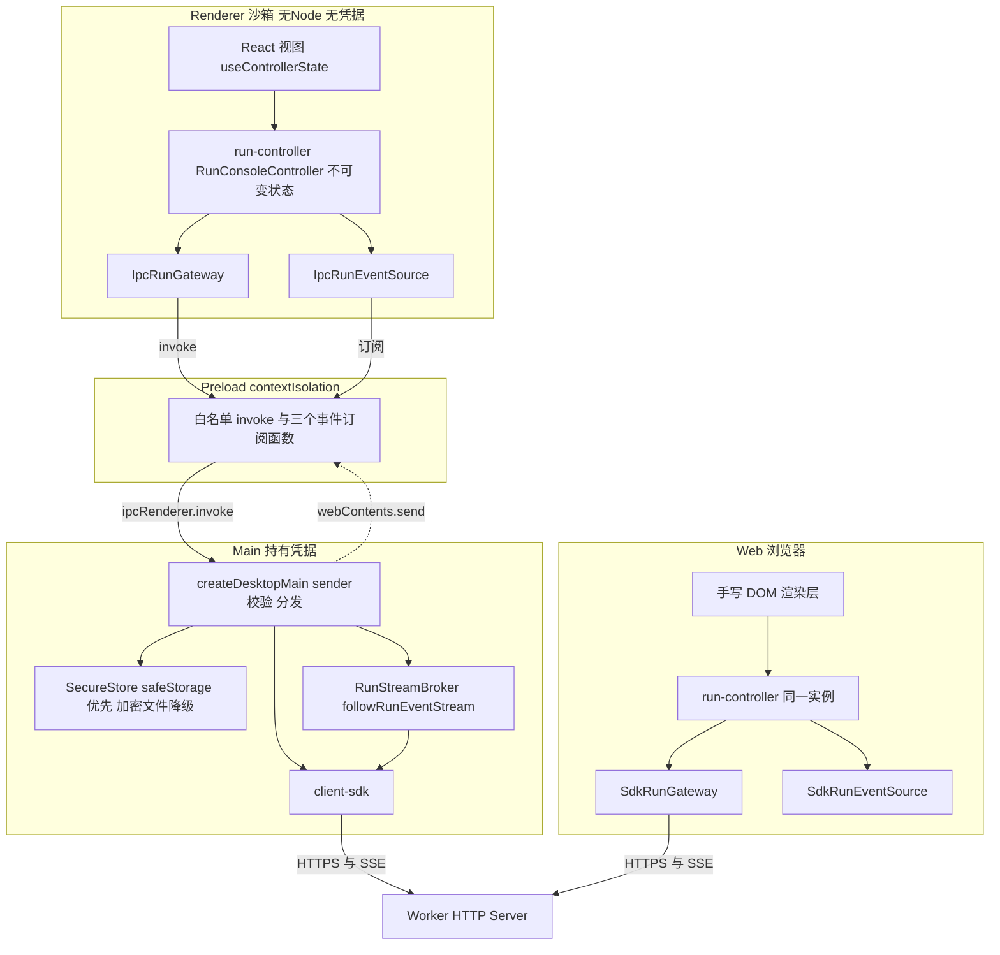

## 产品概述

为 LeCoding Agent 桌面客户端补齐 Phase 4A 的用户闭环：用户安装桌面客户端后，通过设备绑定连接服务器，并在桌面端完成与 Web 完全一致的 Run 管理闭环。

## 核心功能

**M1.1 共享 controller 与 React 视图适配器**

把 `apps/web/src/main.ts` 中 1080 行的页面控制逻辑提炼为框架无关的共享 controller，Web 与桌面 Renderer 消费同一份状态语义；React 只作为 View 适配器，不拥有 Run 状态语义。功能覆盖：

- 连接页：服务器地址、GitHub 登录、访问令牌、设备码绑定
- 项目选择与设备撤销页
- Run 创建、历史列表、详情恢复、断线/重连状态
- 时间线、审批（批准/拒绝/编辑后批准）、用户回答、steer、取消
- Diff 变更与文件列表、验证证据、Artifact 读取、预算面板、keep/discard
- Renderer 只能通过 preload 白名单 IPC 访问能力，不接触 Node、文件系统与网络凭据

**M1.2 原生凭据安全存储**

- Electron `safeStorage` SecureStore adapter（加密后落 0o600 文件）
- 安全存储不可用、系统锁定、密钥损坏、迁移失败的显式失败关闭行为
- 加密文件 backend 仅作显式降级，并在 UI 常驻显示降级状态
- 登出、设备撤销、凭据过期必须清除本地凭据；明文 token 不进日志、配置文件与 Renderer

**M1.3 桌面端到端测试（拆两层）**

- 深业务 E2E：假 ElectronHost + 真实 Worker HTTP 服务 + 真实 client-sdk，覆盖绑定、Run 创建、SSE 恢复、审批、Diff、验证、取消、keep/discard、关闭重开、设备撤销；并回归不受信 IPC sender、外部导航、弹窗阻断
- 浅 GUI E2E：安装后客户端 smoke（环境 gate 显式分类）+ Windows/macOS 人工验收清单与证据归档

**M1.4 正式安装包链路**

- macOS arm64 在 `macos-15` 原生构建、x64 在 `macos-15-intel` 原生构建
- CI 用 Mach-O / PE 头解析校验 runner、Node、中间 `.app`、ZIP、DMG 及所有 `.node` 的实际架构，文件名与内部架构不一致即阻止发布
- 默认消费者版本不交付 MSI / PKG（Windows 仅 Squirrel，macOS 仅 ZIP + DMG）
- 签名与公证证据步骤；证书缺失时按 `LECODING_REQUIRE_SIGNED_ARTIFACTS` 失败关闭，不得降级门禁
- Release job 禁止同名资产互相覆盖

## 视觉形态

深色开发者控制台：顶部常驻连接状态栏（服务器、设备、凭据降级提示），左侧项目与 Run 历史，中部 Run 详情 / 时间线 / Diff，右侧预算 / 验证 / Artifact，底部状态栏（流状态、错误、版本）。审批与用户回答为安全敏感决策区，以高对比卡片独立呈现。

## 技术栈选型

沿用现有仓库技术栈，仅新增最小必要的渲染层依赖：

| 层面 | 选型 | 依据 |
| --- | --- | --- |
| 桌面壳 | Electron 44 + electron-forge 7（既有） | `apps/desktop/package.json` |
| Renderer 视图 | **React 19（新增）** | 用户决策：用 React 渲染，但不用 React 状态架构 |
| Renderer 构建 | Vite 7（新增到 desktop） | `apps/web` 已用 Vite ^7.3.6，复用同一套约定 |
| 状态语义 | **新增 `@lecoding/run-controller`（框架无关）** | 用户决策：复制共享 controller 与投影 seam，不复制手写 DOM |
| 投影层 | **新增 `@lecoding/presentation`**（从 `apps/web/src` 迁入） | `presentation.ts` 已是零 DOM 纯投影层，`run-stream.ts` 已是框架无关 SSE 编排 |
| 语言与门禁 | TypeScript 5.9 strict（`exactOptionalPropertyTypes` / `noUncheckedIndexedAccess` / `verbatimModuleSyntax`）、pnpm 10、turbo、vitest 3 | `tsconfig.base.json` |
| 安全存储 | Electron `safeStorage`（内置，无原生模块） | `packages/secure-store` 的 `SecureStore` 接口已为此预留 |


不引入组件库：asar 打包链路（`scripts/ci-desktop-make.mjs` 的 symlink materialize）已经很脆弱，引入 Tailwind + Radix 会显著放大打包风险；且 `apps/web/src/styles.css` 已有成套设计令牌可复用。

## 实施思路

**总体策略：三层分离——共享 controller 拥有状态语义，transport 由端口接口注入，视图只是投影。**

### 关键决策与权衡

1. **controller 放进 package，React 只做 View 适配器**
`apps/web/src/main.ts` 的 10 个模块级可变变量与 16 个业务函数提炼为 `createRunConsoleController`，产出不可变 `RunConsoleState` 快照并通知订阅者；Web 用手写 DOM 消费，桌面用 `useSyncExternalStore` 消费。理由：避免复制 1080 行控制逻辑；`docs/phase-4-completion-audit.md` 已明确记录该方向（"framework-neutral shared controller plus Web HTTP/SSE and Desktop IPC adapters; React remains a View adapter rather than the owner of Run state semantics"）；未来更换视图框架不必重写业务。权衡：多一个 package、Web 需要一次重构，但这是唯一能同时满足"不复制"和"不锁死 React"的方案。

2. **SSE 由 main 进程持有，Renderer 只做哑 drain**
Renderer 的 CSP 是 `connect-src 'self'`、且 `sandbox: true`、凭据不得进入 Renderer，因此不可能直连 Worker SSE。main 进程用 `followRunEventStream` 完成 cursor 续传 / `sequence` 去重 / 断线重连，再通过 `webContents.send("runs.event", event)` 推送。理由：续传与去重语义只有一份，不会分叉。

3. **`followRunEventStream` 的入参从 `client: LeCodingClient` 改为 `source: RunEventSource` 端口**
只保留 `{ subscribe(runId, { lastEventId?, signal }): AsyncIterable<RunEventV1> }`。Web 侧由 SDK 实现；桌面侧由 IPC 推送队列实现，重连语义由 main 已兜住，renderer 侧 `onReconnect` 仅在 main 报告 failed 时触发。理由：同一份重试与去重逻辑同时服务 HTTP/SSE 与 IPC 推送。

4. **preload 只暴露白名单推送订阅函数，不暴露 `ipcRenderer.on` 本身**
新增 `PUSH_CHANNELS = ["runs.event", "runs.streamState", "session.credentialState"]`，只导出 `onRunEvent` / `onStreamState` / `onCredentialState` 三个订阅函数（返回反注册函数）。理由：防止 Renderer 监听任意内部通道。

5. **`safeStorage` 是 cipher 不是 store**
加密后的密文仍需持久化到 0o600 JSON 文件；抽取内部 `atomic-json.ts` 让 `safe-storage-store.ts` 与 `encrypted-file-store.ts` 共用原子写。降级到加密文件时必须通过 `session.credentialState` 推送并在 UI 常驻展示。密钥损坏/迁移失败抛 `SecureStoreUnavailableError` 而非静默丢弃凭据。

6. **架构校验用纯 Node 解析 Mach-O / PE 头，不依赖 `lipo` / 外部工具**
审计文档要求 "lipo verification of the app and every `.node` inside ZIP/DMG"；纯 Node 头解析等价且跨平台、零依赖、CI 可复现（Windows job 无 `lipo`）。

### 已确认的关键现状（规划依据）

- **阻塞缺陷 A**：`apps/desktop/src/main/index.ts` 的 `webPreferences` 写的是 `preload: undefined`，preload 从未挂载，`window.lecoding` 不存在
- **阻塞缺陷 B**：全仓库无生产 Electron bootstrap——`createDesktopMain` / `createPreloadBridge` 只在测试中被调用，而 `package.json` 的 `main` 指向 `dist/main/index.js`（该文件只导出工厂函数），应用无法启动
- **阻塞缺陷 C**：`forge.config.ts` 的 `rendererEntry: "../renderer/dist/index.html"` 解析到不存在的 `apps/renderer/`
- `IPC_CHANNELS` 仅 11 个通道，缺 `getControlPlaneConfig`、审批三件套、`answerRun`、`steerRun`、`getRunChanges`、`getRunArtifact`、`policy.*`，且完全没有事件订阅/推送通道
- `ElectronWebContentsLike` 没有 `send` 方法，无法向 Renderer 推送
- `packages/secure-store` 无 `safeStorage` / keytar adapter，无降级与 health 概念
- `apps/desktop/src/main/index.ts` 与 `test/main.test.ts`、`test/preload.test.ts` 遗留调试 `console.error` / `process.stdout.write`
- CI 的 darwin/x64 job 跑在 `macos-latest`（已是 arm64 硬件），这是"x64 产出 arm64"的根因

### 性能要点

- **事件推送**：main 侧每个 runId 单订阅，按 `sequence` 去重；Renderer 侧 controller 在同一 microtask 内合并多次 `setState` 为一次通知，避免 React 重复渲染。时间线为短数组（数百条量级），追加用一次数组复制，不做深比较
- **避免 N+1**：沿用 Web 现有语义（每个事件后 `inspectRun`），但 controller 内对同一 runId 的 inspect 做 in-flight 合并，重连风暴时不叠加请求
- **打包体积**：React + Vite 产物进入 asar；`pnpm install --filter @lecoding/desktop...` 必须覆盖 renderer 依赖（CI 脚本已按此过滤），`materializeWorkspaceLinks` 会把新增的 `@lecoding/presentation` / `@lecoding/run-controller` 实体化

## 架构设计



数据流（桌面）：用户操作 → React 调 controller action → controller 经 `IpcRunGateway` 调 `window.lecoding.<channel>` → preload 校验 → main 校验 sender + payload → client-sdk → Worker。反向：Worker SSE → main 的 `RunStreamBroker`（续传 + 去重）→ `webContents.send("runs.event")` → preload 白名单转发 → `IpcRunEventSource` 队列 → controller 的 `followRunEventStream` → `onEvent` 追加时间线并 `inspectRun` → 新 state 快照 → React 重渲染。

## 目录结构

新增 2 个共享 package（`@lecoding/presentation` / `@lecoding/run-controller`）、1 个 React renderer、main 进程生产 bootstrap 与 SSE broker、secure-storage 原生后端、发布架构校验；重构 Web 主控制器为薄渲染层。

```
packages/presentation/                          [NEW] 零 DOM 的共享投影与 SSE 编排层
├── package.json                                依赖仅 @lecoding/contracts(type-only)
├── tsconfig.json
├── src/index.ts                                汇总导出
├── src/presentation.ts                         从 apps/web/src 原样迁入：statusLabel / isTerminalStatus /
│                                               canLoadRunChanges / canResolveRunResult / formatRunBudget /
│                                               formatApprovalDetails / formatEditableApproval /
│                                               approvalModeOptions / resolveProjectSelection /
│                                               formatEventTitle / formatRunEventDetail / isTerminalRunEvent /
│                                               verificationTone / formatProjectPolicyRule
├── src/run-stream.ts                           迁入并把 client 参数改为 RunEventSource 端口；
│                                               保留 lastSequence 续传、sequence 去重、重连、终态移交
└── test/
    ├── presentation.test.ts                    投影纯函数与不可信文本降级
    └── run-stream.test.ts                      续传、去重、重连、AbortSignal

packages/run-controller/                        [NEW] 框架无关的 Run 控制台状态机
├── package.json                                依赖 @lecoding/contracts + @lecoding/presentation
├── tsconfig.json
├── src/index.ts                                汇总导出
├── src/events.ts                               RunEventSource 端口接口
├── src/gateway.ts                              RunGateway 端口接口 + isUnauthorized 统一错误判定
├── src/state.ts                                RunConsoleState / ConsolePhase / StreamPhase 类型
├── src/controller.ts                           createRunConsoleController：initialize / logout /
│                                               selectProject / createRun / selectRun / cancelCurrentRun /
│                                               discardCurrentResult / approveCurrent / rejectCurrent /
│                                               setApprovalDraft / editAndApproveCurrent /
│                                               setUserResponseDraft / answerCurrent / steerCurrent /
│                                               loadArtifact / revokePolicyRule / dismissError / dispose
└── test/
    ├── controller.test.ts                      全动作状态迁移、pending 互斥、审批草稿不被 SSE 覆盖
    └── reconnect.test.ts                       断线 / 重连 / 终态 / 切换 Run 中止旧流

apps/web/                                       [MODIFY] 瘦身为 controller 的薄 DOM 渲染层
├── src/main.ts                                 重写：装配 controller + render(state)；删除 10 个模块级变量
├── src/gateway.ts                       [NEW]  SdkRunGateway：createClient 适配 RunGateway
├── src/events.ts                        [NEW]  SdkRunEventSource：subscribeRunEvents 适配 RunEventSource
├── src/presentation.ts                  [DEL]  迁至 packages/presentation
├── src/run-stream.ts                    [DEL]  迁至 packages/presentation
└── package.json                                增加 @lecoding/presentation / @lecoding/run-controller 依赖

packages/secure-store/                          [MODIFY] 原生后端与显式降级
├── src/atomic-json.ts                   [NEW]  readJsonFile / writeJsonFile（tmp + rename，mode 0o600）
├── src/safe-storage-store.ts            [NEW]  createSafeStorageSecureStore：SafeStorageLike 端口
│                                               （isEncryptionAvailable / encryptString / decryptString）
│                                               + 密文落盘 + 解密失败抛 SecureStoreUnavailableError
├── src/select-backend.ts                [NEW]  SecureStoreBackend / SecureStoreHealth 类型与
│                                               createSecureStoreWithFallback：safeStorage → 加密文件 → 抛错
├── src/index.ts                                导出新模块与 health 类型
├── src/encrypted-file-store.ts                 改为复用 atomic-json（行为不变）
└── test/
    ├── safe-storage-store.test.ts       [NEW]  不可用 / 系统锁定 / 密钥损坏 / 迁移失败 / 往返
    └── select-backend.test.ts           [NEW]  后端选择、降级原因、禁止静默降级到内存

apps/desktop/
├── src/main/
│   ├── electron.ts                      [NEW]  生产 bootstrap：导入真实 electron，装配 ElectronHost /
│   │                                           ClientSdkFactory（注入 secureStore）/ preload 路径 /
│   │                                           rendererEntry（app.getAppPath 拼接），app.whenReady
│   ├── host.ts                          [MOD]  ElectronWebContentsLike 增加 send；ElectronHost 增加
│   │                                           safeStorage 与 app.getPath("userData")；ClientSdk 补齐方法
│   ├── index.ts                         [MOD]  删除 4 处 console.error 调试；补齐新通道分发；
│   │                                           webPreferences.preload 接真实路径；closed/before-quit 清理订阅
│   ├── stream-broker.ts                 [NEW]  RunStreamBroker：runId → {AbortController, lastSequence}；
│   │                                           followRunEventStream + 推送 runs.event / runs.streamState；
│   │                                           unsubscribe / 窗口关闭 / quit 时中止
│   └── secure-store-factory.ts          [NEW]  选取后端、暴露 health、登出与撤销时清除命名空间
├── src/preload/index.ts                 [MOD]  PreloadIpcRenderer 增加 on/removeListener；
│                                               PUSH_CHANNELS 白名单；暴露 onRunEvent / onStreamState /
│                                               onCredentialState（返回反注册函数）；BridgeError 增加 status
├── src/shared/ipc-contract.ts           [MOD]  新增通道 config.load / runs.approve / runs.reject /
│                                               runs.editApprove / runs.answer / runs.steer / runs.changes /
│                                               runs.artifact / runs.subscribe / runs.unsubscribe /
│                                               policy.list / policy.revoke / session.status；
│                                               新增 PUSH_CHANNELS 常量与负载类型；IpcErrorCode 增加
│                                               unauthorized / forbidden / credential_expired
├── src/renderer/                        [NEW]  React 视图适配器
│   ├── index.html
│   ├── main.tsx                                装配 IPC gateway + event source + controller，挂载 App
│   ├── App.tsx                                 五屏路由与布局骨架
│   ├── use-controller-state.ts                 useSyncExternalStore 订阅（约 5 行，非状态架构）
│   ├── gateway/ipc-gateway.ts                  window.lecoding.invoke 适配 RunGateway
│   ├── gateway/ipc-event-source.ts             推送队列适配 RunEventSource
│   ├── components/
│   │   ├── ConnectionBar.tsx                   顶栏：服务器、设备、连接状态、降级提示
│   │   ├── DeviceBindingPage.tsx               连接与设备码绑定屏
│   │   ├── ProjectSidebar.tsx                  项目选择与角色
│   │   ├── RunHistoryList.tsx                  Run 历史与状态徽章
│   │   ├── RunComposer.tsx                     任务、环境、验收条件、审批模式
│   │   ├── RunDetail.tsx                       Run 头部、预算、结果处置
│   │   ├── Timeline.tsx                        事件时间线（仅 textContent）
│   │   ├── ApprovalCard.tsx                    批准 / 拒绝 / 编辑后批准 + scope 选择
│   │   ├── UserRequestCard.tsx                 用户回答与 steer
│   │   ├── ChangesPanel.tsx                    变更文件与统一 Diff
│   │   ├── VerificationPanel.tsx               验证证据卡片
│   │   ├── BudgetPanel.tsx                     预算与告警
│   │   ├── ArtifactPanel.tsx                   超限输出读取
│   │   ├── DeviceManagerPage.tsx               设备列表与撤销
│   │   ├── StatusBar.tsx                       底栏：流状态、错误、版本
│   │   └── DegradedStorageBanner.tsx           安全存储降级常驻提示
│   └── styles/renderer.css                     复用并扩展 apps/web/src/styles.css 设计令牌
├── vite.renderer.config.ts              [NEW]  root: src/renderer，outDir: ../../dist/renderer
├── src/build/
│   ├── architecture.ts                  [NEW]  纯 Node 解析 Mach-O / PE 头，校验 .app 与所有 .node 架构
│   ├── release-assets.ts                [NEW]  资产清单唯一性校验，阻止同名资产互相覆盖
│   └── forge-config.ts                  [MOD]  移除 maker-pkg（消费者版本不交付）；资产唯一性校验
├── test/
│   ├── ipc-contract.test.ts             [MOD]  新通道校验器与错误码
│   ├── main.test.ts                     [MOD]  删除调试输出；补 preload 断言与推送权限
│   ├── preload.test.ts                  [MOD]  删除调试输出；补白名单订阅与反注册
│   ├── stream-broker.test.ts            [NEW]  订阅生命周期、去重、推送、中止
│   ├── architecture.test.ts             [NEW]  Mach-O / PE 头解析与架构不一致拒绝
│   ├── release-assets.test.ts           [NEW]  同名资产与缺失资产拒绝
│   ├── run-loop.integration.test.ts     [NEW]  深业务 E2E（真实 Worker HTTP + 假 ElectronHost）
│   └── installed-app.smoke.test.ts      [NEW]  浅 GUI E2E（LECODING_INSTALLED_APP_PATH 环境 gate）
├── forge.config.ts                      [MOD]  rendererEntry 修正为 dist/renderer/index.html
├── tsconfig.json                        [MOD]  增加 jsx: react-jsx
├── vite.renderer.config.ts              [NEW]  见上
└── package.json                         [MOD]  main 指向 dist/main/electron.js；新增 react / react-dom /
                                               @types/react / @vitejs/plugin-react / vite 与两个新 workspace 包；
                                               新增 build:renderer 与 build 脚本

.github/workflows/desktop-release.yml    [MOD]  arm64 → macos-15；x64 → macos-15-intel；
                                               增加 runner/Node 架构预检、架构校验步骤、签名证据步骤、
                                               LECODING_REQUIRE_SIGNED_ARTIFACTS 失败关闭、发布前同名资产校验
scripts/ci-desktop-make.mjs              [MOD]  构建 renderer；调用 architecture 与 release-assets 校验
docs/
├── evidence/desktop-m1-smoke-checklist.md [NEW] Windows / macOS 人工验收清单与证据归档模板
├── phase-4-status.md                    [MOD]  Electron shell 由 Skeleton 提升到实际闭环
├── phase-4-completion-audit.md          [MOD]  补齐 safeStorage 与签名/架构证据行
├── m1-completion-summary.md             [NEW]  M1 完成总结（验收命令与实测结果）
└── latest-development-plan.md           [MOD]  M1.1 措辞改为"共享 controller + React 视图适配器"并勾选进度
```

## 关键代码结构

三个跨模块依赖的端口契约（接口级定义，不含实现）：

```ts
// packages/run-controller/src/events.ts
// Renderer 侧事件源端口。Web 由 SDK SSE 实现，桌面由 IPC 推送队列实现。
// 实现方义务：必须按 sequence 升序投递；重连时从 lastEventId 之后续传；
// signal abort 后必须尽快结束迭代。
export interface RunEventSource {
  subscribe(
    runId: RunId,
    options: { lastEventId?: string; signal: AbortSignal }
  ): AsyncIterable<RunEventV1>;
}

// packages/run-controller/src/gateway.ts
// controller 唯一依赖的能力端口。实现方（SdkRunGateway / IpcRunGateway）
// 必须把 HTTP 401 归一化为可判定的未授权错误，其余错误原样上抛。
export interface RunGateway {
  getControlPlaneConfig(): Promise<ControlPlaneConfig>;
  logout(): Promise<void>;
  createRun(projectId: ProjectId, input: CreateRunInput): Promise<CreateRunResult>;
  inspectRun(runId: RunId): Promise<RunView>;
  listRuns(projectId: ProjectId, limit?: number): Promise<RunHistoryResult>;
  cancelRun(runId: RunId): Promise<void>;
  resolveRunResult(runId: RunId, outcome: "keep" | "discard"): Promise<void>;
  getRunChanges(runId: RunId): Promise<RunChanges>;
  getRunArtifact(runId: RunId, artifactId: string): Promise<string>;
  approveRun(runId: RunId, approvalId: string, scope: ApprovalScope): Promise<void>;
  rejectRun(runId: RunId, approvalId: string, scope: ApprovalScope): Promise<void>;
  editAndApproveRun(
    runId: RunId,
    approvalId: string,
    replacement: EditedApprovalCapability
  ): Promise<void>;
  answerRun(runId: RunId, requestId: string, value: string): Promise<void>;
  steerRun(runId: RunId, message: string): Promise<void>;
  listProjectPolicyRules(projectId: ProjectId): Promise<ProjectPolicyRuleResult>;
  revokeProjectPolicyRule(projectId: ProjectId, ruleId: string): Promise<void>;
}
```

```ts
// packages/run-controller/src/state.ts
// controller 对外暴露的唯一状态快照。视图只能读取，不能写入。
// discardedRunIds 为数组而非 Set，保证快照可结构化比较与序列化。
export type ConsolePhase = "loading" | "needs_auth" | "offline" | "ready";
export type StreamPhase =
  | "idle" | "connecting" | "live" | "reconnecting" | "closed" | "failed";

export interface RunConsoleState {
  phase: ConsolePhase;
  bootstrap?: ControlPlaneConfig;
  selectedProjectId?: ProjectId;
  recentRuns: RunSummary[];
  selectedRunId?: RunId;
  currentRun?: RunView;
  timeline: RunEventV1[];
  changes?: RunChanges;
  changesMessage?: string;
  artifactText?: string;
  stream: { phase: StreamPhase; runId?: RunId };
  pending: {
    creating: boolean;
    cancelling: boolean;
    resolving: boolean;
    approval: boolean;
    userRequest: boolean;
    artifact: boolean;
  };
  // 以 approvalId 为键，SSE 刷新不得覆盖用户正在编辑的内容
  approvalDraft?: { approvalId: string; value: string };
  userResponseDraft: string;
  discardedRunIds: string[];
  policyRules: ProjectPolicyRule[];
  policyRulesVisible: boolean;
  credential?: { backend: SecureStoreBackend; degraded: boolean; reason?: string };
  error?: string;
}
```

```ts
// apps/desktop/src/shared/ipc-contract.ts（增补）
// 推送通道与请求通道分离：请求通道可 invoke，推送通道只能订阅。
// preload 只暴露三个具名订阅函数，绝不暴露 ipcRenderer.on 本身。
export const PUSH_CHANNELS = [
  "runs.event",
  "runs.streamState",
  "session.credentialState"
] as const;
export type PushChannel = (typeof PUSH_CHANNELS)[number];

export interface RunEventPush {
  runId: RunId;
  event: RunEventV1;
}
export interface StreamStatePush {
  runId: RunId;
  phase: "connecting" | "live" | "reconnecting" | "closed" | "failed";
}
export interface CredentialStatePush {
  backend: "safeStorage" | "encryptedFile";
  degraded: boolean;
  reason?: string;
  deviceId?: string;
  expiresAt?: string;
}
```

## 实施注意事项

- **TDD 与门禁**：按 `AGENTS.md` 与计划文档 §3，每个切片先从公开 seam 写失败测试；每个工作包独立提交，禁止把门禁修复、功能扩展与无关重构混在一起；合并前跑 `pnpm test` 与 `pnpm typecheck`
- **新增通道的改动面是六处联动**：`IPC_CHANNELS` → `IpcRequestByChannel` → `ipcRequestSchema` validator → `host.ts` 的 `ClientSdk` → `main/index.ts` 的 dispatch switch → preload bridge。漏任何一处都会导致通道不可用
- **`exactOptionalPropertyTypes: true`**：可选属性不能显式赋值 `undefined`，写状态更新时要用条件展开而非 `foo: undefined`
- **深业务 E2E 依赖 loopback 监听**：M0.3 已记录受限沙箱禁止 loopback，该测试必须有显式环境 gate 与分类，并提供 CI 复验命令，不得混入业务失败
- **调试输出清理**：`main/index.ts` 的 4 处 `console.error` 与 `test/main.test.ts` 第 67 行、`test/preload.test.ts` 第 72 行的调试语句必须删除，否则会污染 CI 日志
- **签名证书是外部依赖**：证书就绪与未就绪两条路径都要写清楚；未就绪时产物必须标记为 prerelease 且不得放行正式发布，绝不能靠降级 `verifySignature` 或移除校验来"让 CI 变绿"
- **typecheck 计数口径**：M0 总结为 20/20（`@lecoding/test-harness` 无 typecheck 任务），新增 2 个 package 后含 typecheck 任务的 workspace 数为 22；计划文档 §9 写的 21/21 需同步修正

## 设计风格

**IDE 原生深色开发者控制台（Developer Console Dark）**。这是一台给人用的"AI 编码 Agent 操作台"，不是营销页：深色底、高信息密度、状态一眼可辨、键盘可达。设计语言与 `apps/web/src/styles.css` 的既有令牌保持一致，桌面端只做密度与层级的适配。

关键词：深色 / 高对比 / 信息密度 / 状态色语义化 / 极轻玻璃分层 / 微动效。

- **背景与层次**：应用底 `#0B0F14`，面板 `#111823`，抬升卡片 `#18202C`，代码与 Diff 表面 `#0E141C`。层级靠极细的 1px 分隔线 `#212C3B` 与 6–8px 圆角区分，不用重阴影。
- **动效**：状态徽章与流状态点用 1.2s 缓动呼吸（仅 running / connecting）；时间线新条目 120ms 淡入上移；审批卡片进入时 160ms 从左滑入并短暂高亮边框。全部控制在 200ms 内，不干扰长时间阅读。
- **交互**：Hover 抬升 1 级背景；Focus 用 2px `#4C8DFF` 焦点环；危险操作（discard、reject、设备撤销）强制二次确认且按钮为描边红而非实心红。
- **响应式**：三栏在窗口宽度 < 1200px 时折叠右栏到中栏底部，< 900px 时左栏变为可收起抽屉。
- **字体**：拉丁用 Roboto，中文回退 PingFang SC / 思源黑体；代码、Diff、时间线负载用系统等宽栈 `ui-monospace, SFMono-Regular, Menlo, Consolas`（不引入字体文件，零体积）。

## 页面规划（5 屏）

所有屏共享**顶部连接栏**（服务器地址、已绑定设备、连接状态点、凭据降级提示、窗口控制）与**底部状态栏**（流状态、错误文本、应用版本、更新提示）。

### 1. 连接与设备绑定屏（首次启动 / 未绑定）

- 顶部连接栏：服务器地址输入 + 连接状态点，未连接时隐藏其余入口。
- 服务器卡片：地址输入、连接按钮、连通性反馈与错误文案区。
- 认证卡片：GitHub 登录按钮 + 访问令牌输入（令牌长度不足 32 字符时禁用并提示）。
- 设备码卡片：生成设备码（等宽大字展示、倒计时）、设备标签输入、绑定按钮。
- 底部状态栏：流状态 idle、版本、离线提示。

### 2. Run 控制台主屏（核心）

- 左栏项目与历史：项目下拉（含角色徽章）、Run 历史列表（任务摘要 + 状态 + 更新时间，选中项高亮）。
- 中栏 Run 详情：状态徽章、Run ID、任务、取消按钮、结果处置（keep/discard）按钮。
- 中栏时间线：按事件类型着色的纵向时间线，标题 + 详情 + 时间，新条目自动滚动。
- 右栏预算面板：模型、Token、成本、墙钟、工具调用、重试、团队成本与告警 chip。
- 右栏验证与 Artifact：验证证据卡片（按 outcome 着色）、超限输出列表与读取区。

### 3. 变更与 Diff 屏

- 变更概览条：变更文件数、截断提示、来源说明。
- 变更文件列表：路径等宽展示，点击定位到 Diff。
- 统一 Diff 面板：等宽、语法着色（增删行底色），仅 `textContent` 渲染。
- 结果处置区：keep / discard 双按钮，discard 强制二次确认。
- 底部状态栏：当前 Run 状态与工作区清理提示。

### 4. 审批与用户回答屏（安全敏感决策）

- 审批摘要卡：目标、能力类型、风险等级、原因，全部等宽展示。
- 审批编辑区：命令 argv 逐行编辑或网络域名编辑，附约束说明。
- 作用域选择：once / run / project 三档，带长期影响提示。
- 决策按钮组：批准（实心主色）、拒绝（描边红）、编辑后批准，操作进行中禁用。
- 用户请求卡：模型提问原文、回答输入、回答 / steer 双入口，附 4000 字符上限提示。

### 5. 设备与凭据管理屏

- 设备列表：设备标签、平台、创建时间、最后使用、过期时间。
- 撤销操作区：单设备撤销按钮，二次确认后清除本地凭据。
- 安全存储状态卡：当前后端（系统钥匙串 / 加密文件）、是否降级、降级原因。
- 会话操作区：登出按钮（清除本地凭据并回到屏 1）。
- 底部状态栏：凭据过期倒计时与版本。

## Agent Extensions

### Skill

- **codebase-design**
- 用途：在 M1.1 设计 `RunGateway` / `RunEventSource` 端口与 `RunConsoleController` 的模块边界，确认接缝落在"深模块"的正确位置（最小接口、最大实现隐藏）。
- 预期产出：一份明确的接缝决策——controller 只依赖两个端口、视图只依赖不可变快照，React 与 Web DOM 都只是可替换的消费者。

- **tdd**
- 用途：每个工作包按 `AGENTS.md` 要求的红—绿—重构推进，先写失败测试再写最小实现（尤其 controller 状态迁移、IPC 通道校验、safeStorage 失败关闭、架构校验拒绝）。
- 预期产出：每个切片都有先红后绿的聚焦测试证据，合并前 `pnpm test` 与 `pnpm typecheck` 全绿。

- **code-review**
- 用途：每个工作包提交前做标准与规格双轴评审（是否遵守仓库注释/门禁约定，是否匹配 `latest-development-plan.md` §6 M1 的四个工作包范围）。
- 预期产出：每个工作包独立、范围不溢出，门禁修复与功能扩展不混在同一提交。

### SubAgent

- **code-explorer**
- 用途：在实施各工作包时定位所有调用点与遗漏的联动改动面（新增 IPC 通道的六处联动、Web 渲染函数的完整映射、`asarUnpack` 与 maker 的引用点）。
- 预期产出：不遗漏任何调用点，避免改完一处而另一处静默失效。